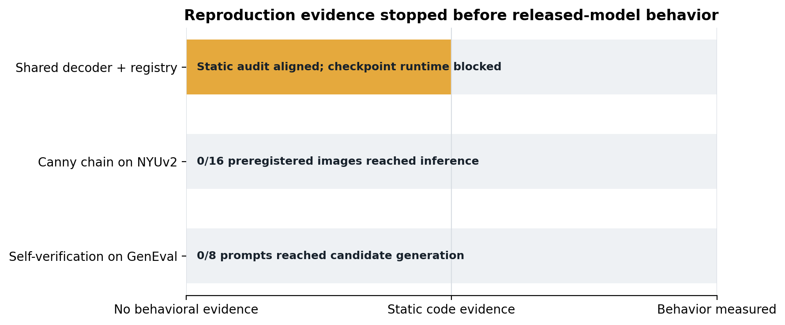
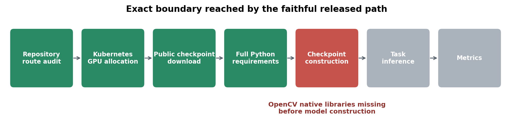
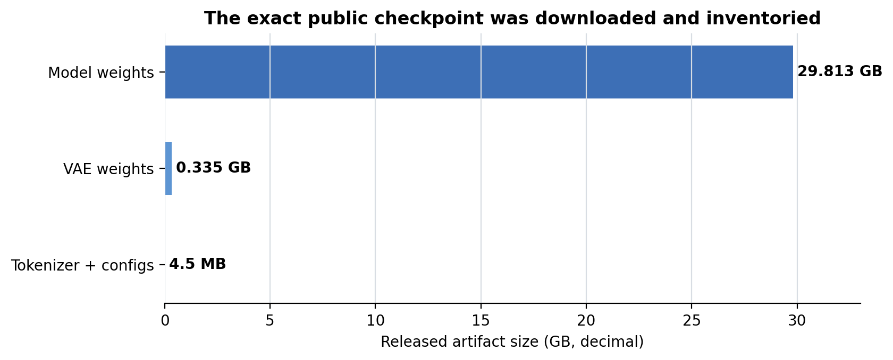

# Reproducing MODUS’s shared decoder, Canny chaining, and self-verification

MODUS proposes one decoder that can translate among text, images, depth, surface normals, edges, and grounding instead of loading a different model for every task. This reproduction set out to check the released model itself, then measure whether an edge-map detour helps surface-normal prediction and whether the model can choose better generated images using its own scores. The public checkpoint and benchmark slices were fixed in advance so setup diagnostics could not be substituted for model behavior.

## Verdict

**Blocked; behavioral claims were not reproduced.** A successful Kubernetes code audit aligned with the shared-routing design, and the exact 30.15 GB public checkpoint was downloaded and inventoried. However, every GPU path stopped before checkpoint construction on released-environment dependencies, so no NYUv2 prediction or GenEval candidate exists. The paper’s behavioral numbers therefore remain untested, not contradicted.

**Scope:** 16 preregistered examples from the public 654-image NYUv2 validation split and eight object-only GenEval prompts were prepared. None reached inference. The run window used Kubernetes, NVIDIA RTX PRO 6000 Blackwell GPUs, a peak allocation of 16 GPUs, and 0.82 hours elapsed wall time.

The bar position distinguishes code evidence from released-model behavior. Only the first claim has static evidence; the two quantitative claims have zero measured examples.

## What the paper reports

| Claim | Paper result | Observed here | Assessment |
|---|---:|---:|---|
| One checkpoint and shared route | One decoder and a 16-modality registry | One `InterleaveInferencer`, 16 registry entries, one chained flag in the same call path | Static design aligned; runtime inconclusive |
| RGB→normal vs RGB→Canny→normal | 20.02° vs 19.87° MAE on 654 NYUv2 images; 9.07 vs 20.05 s/image at 50 steps | No predictions | Inconclusive |
| Best-of-four self-verification | GenEval 0.81 unranked, 0.82 grounding, 0.84 VQA+grounding | No candidates | Inconclusive |

The paper values come from Tables 2, 3, 14, and 15. This reproduction deliberately reports no proxy number in their place.

## Implementation path audited

The released CLI loads one checkpoint and constructs one inferencer in [`infer.py`](../../infer.py). Target behavior is selected from [`conf/modalities/instruction_16mod_stage2.yaml`](../../conf/modalities/instruction_16mod_stage2.yaml), whose 16 entries include RGB, depth, normals, Canny, caption, detection, and feature modalities. Direct and chained requests both enter `InterleaveInferencer.__call__`; chaining is a flag that reuses the same object and appends an intermediate to the unified context.

The successful CPU-only Kubernetes audit parsed those sources and emitted their registry hash, class inventory, and routing assertions. This supports the repository-architecture portion of the first claim. It does not establish that the downloaded weights load, that every modality produces sensible output, or how the model was trained.

The GPU runs reached real cluster allocation and public artifact download. A minimized environment first exposed missing declared Python packages. The subsequent full `requirements.txt` environment reached OpenCV import, but the CUDA runtime image lacked `libGL.so.1`; after the permitted repair added `libgl1`, it stopped on `libgthread-2.0.so.0`. The two-attempt repair cap closed that node before model construction.

## Public artifacts and planned measurements

The public, ungated `EPFL-VILAB/MODUS` snapshot contained a 29.813 GB model tensor, a 0.335 GB autoencoder tensor, and tokenizer/configuration files. All GPU jobs saw four 97,887 MiB RTX PRO 6000 Blackwell devices per pod.

The paired NYUv2 protocol fixed indices `[0, 41, …, 629]`, seeds `20260729 + index`, 512-pixel output, and 5/10/20-step variants. It would have decoded normal RGB values to unit vectors and computed paired valid-pixel angular MAE, latency, and peak memory. The self-verification protocol fixed four single-object and four two-object GenEval prompts, four seeds per prompt, MODUS grounding likelihood for selection, and COCO-DETR only for post-selection evaluation; random, edge-density, and oracle selectors were preregistered. These are prepared protocols, not evidence.

## Compute and limitations

From the first Kubernetes launch to the final successful audit, elapsed wall time was 0.82 hours. Peak concurrent allocation was 16 NVIDIA RTX PRO 6000 Blackwell GPUs; individual GPU experiments requested four. The only successful terminal run was the CPU static audit because AST/YAML inspection does not benefit from a GPU. GPU logs are diagnostic failures and are not counted as successful model runs.

The main limitation is therefore binary: the checkpoint never entered memory. A future continuation should start from a CUDA image with GLib/GL libraries preinstalled or use the repository’s headless OpenCV dependency, validate one model load, and only then descend to the already fixed NYUv2 and GenEval protocols.

## Reproducibility links

- [Successful Kubernetes static architecture audit](https://github.com/alphaXiv/modus-78de6e8e/tree/orx/kubernetes-static-architecture-evidence)
- [Full released-environment load audit](https://github.com/alphaXiv/modus-78de6e8e/tree/orx/full-released-environment-load-audit)
- [Prepared paired NYUv2 evaluation](https://github.com/alphaXiv/modus-78de6e8e/tree/orx/nyuv2-paired-direct-and-canny-chain)
- [Prepared GenEval self-verification evaluation](https://github.com/alphaXiv/modus-78de6e8e/tree/orx/geneval-grounding-self-verification)

